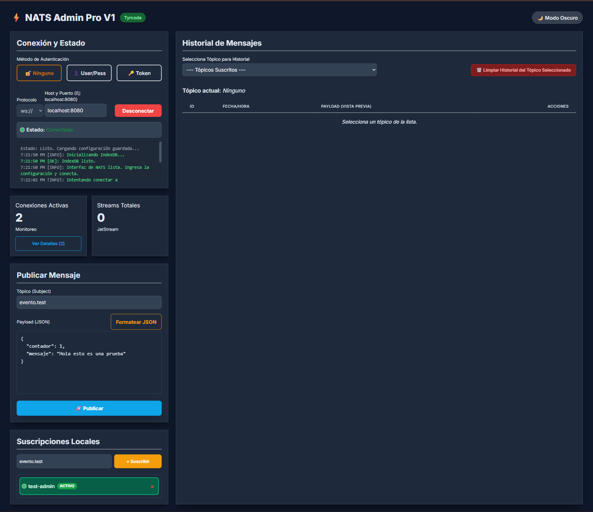

# 🚀 NATS Admin Pro V1 - GUI tool for NATS

**NATS Admin Pro** is a simple but powerful GUI tool, built with pure HTML and JavaScript, that allows you to interact with a NATS server via WebSockets (WS). It is ideal for **development**, **testing**, and **debugging** environments.


## ✨ Key Features

- **Easy to Use:** Just HTML and JS. Open it directly in your browser!
- **Flexible Connection:** Supports connection **without credentials**, **Token**, or **Username/Password**.
- **Rapid Development Environment:** Includes `docker-compose` to set up a local NATS server with JetStream and WS.
- **Publish/Subscribe:** Send messages to topics and monitor received messages in real time.
- **Versatility:** Connect to **local** or **remote** NATS servers.

---

## 🛠️ Requirements

1.  **Web Browser:** Any modern browser (Chrome, Firefox, Edge, etc.).
2.  **Docker (Optional):** Only necessary if you want to set up the local NATS development server.

---

## 🏁 Roadmap and Usage

There are two main scenarios for using this tool: the local development environment and connecting to remote NATS servers.

### Scenario A: Local Development with Docker

This is the recommended method to get started quickly, as it sets up a local NATS server configured to use WebSockets.

#### **1. Initial Setup**

1.  **Clone the Repository:**

```bash
git clone git@github.com:Tyrcode/nats-admin.git
cd nats-admin
```

2.  **Start the NATS Server:** Run Docker Compose. This launches the NATS server with JetStream and enables port **8080** for WebSockets, according to the configuration in `nats-server.conf`.

```bash
docker compose up -d
```

#### **2. Connecting to the GUI**

1.  **Open the Tool:** **Double-click** the `index.html` file or open it directly in your browser.
2.  **Connect:**

- **Host/URL:** Use the default address: `ws://localhost:8080`.
- **Credentials:** Select **“No Credentials”** (by default, the local server does not require authentication).
  - Click the **Connect** button.

#### **3. Shut Down the Environment (Optional)**

To stop and clean up the NATS container:

```bash
docker compose down
```

---

### Scenario B: Connecting to a Remote NATS Server

Use this option to connect to any NATS server in the cloud or in production that exposes a WebSocket port (WS or WSS).

1.  **Open the Tool:** **Double-click** the `index.html` file in your browser. **You do not need Docker for this step.**
2.  **Configure Remote Connection:**

- **Host/URL:** Enter the URL or IP and WebSocket port of the remote server (e.g., `wss://nats.mycompany.com:443`).
  - **Credentials:** Select the authentication method required by the server:
    - **Token:** Enter the security token.
    - **Username/Password:** Enter the credentials.

3.  **Connect:** Click the **Connect** button.

---

## 🧑‍💻 Publishing and Subscribing

Once connected, the interface will allow you to:

- **Subscribe:** Enter a **topic** name (e.g., `app.logs.api`) and click **Subscribe**. Received messages will appear in the history.
- **Publish:** Enter the destination **topic** and **Payload** (the message content, typically JSON or text) and click **Publish**. Published messages will instantly appear in the subscriptions section if you are subscribed to that topic.
